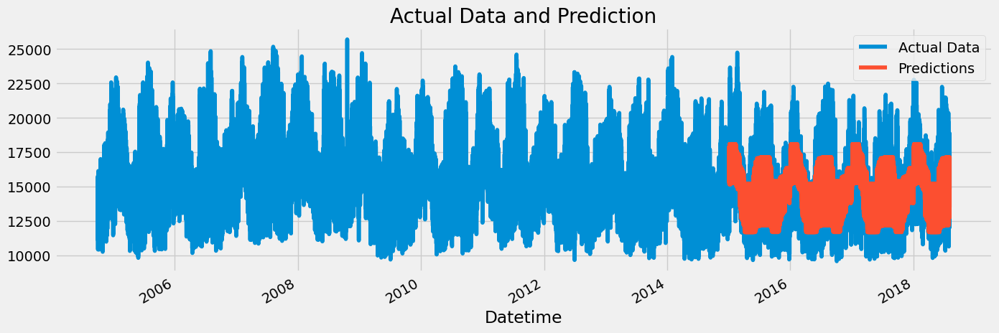

# Timeseries Forecasting using XGBoost

## Overview

This repository is focused on time-series forecasting using data from Hourly Energy Consumption. The primary goal is to develop and evaluate a time-series forecasting model for predicting energy consumption patterns over time. Understanding these patterns is crucial for efficient resource planning and management.

## Data

- Hourly Energy Consumption by Rob Mulla (Kaggle)

## Methodology

The time-series forecasting is performed using XGBoost, a powerful gradient-boosting algorithm. The dataset is preprocessed and features are engineered to enhance the model's performance. The model is then trained on historical data, and predictions are made for future periods.

## Analysis

Jupyter Notebooks scripts detail the entire process, including data exploration, preprocessing, model training, and evaluation. Visualizations are provided to illustrate the actual vs. predicted energy consumption patterns.

## Results

 

**Highest RMSE**  
The following timestamps had the highest RMSE values, indicating significant deviations between predicted and actual values:
  - **2015-02-19**: 5630.35
  - **2015-02-20**: 5394.67
  - **2018-01-06**: 4823.35

**Lowest RMSE**  
The following timestamps had the lowest RMSE values, indicating accurate predictions:
- **2017-10-29**: 250.09
- **2015-03-13**: 269.70
- **2016-02-16**: 278.77


## Usage

1. Clone the repository:

   ```bash
   git clone https://github.com/your-username/timeseries-forecasting.git
